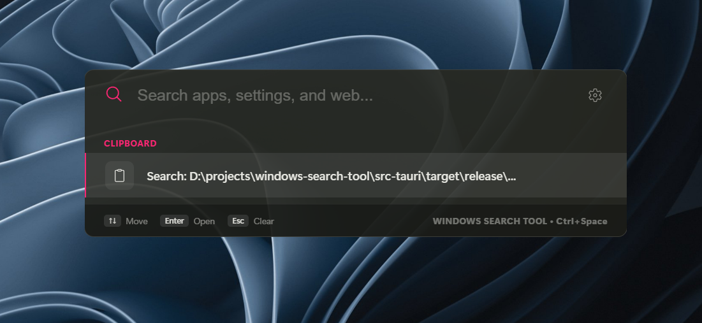
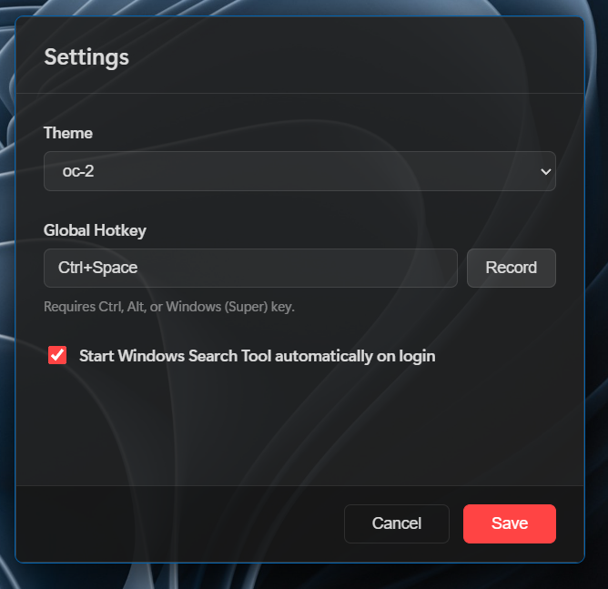

<div align="center">


# Glimpse

A small search palette for Windows 11.

[](https://tauri.app)
[](https://www.rust-lang.org)
[](https://react.dev)
[](LICENSE)

</div>

<div align="center" style="display: flex; justify-content: center; gap: 20px; flex-wrap: wrap;">




</div>

## Why

I got tired of Windows Search. It's slow to open, it indexes stuff I don't care about, it misses stuff I do, and half the time the result I want isn't the one on top.

Glimpse is my replacement. It's a single exe that sits in the tray and pops up when you press `Ctrl+Space`. You type, it shows matches, you hit Enter. That's about it.

It searches installed apps, system settings and files. The app index is built from your Start Menu when Glimpse starts and kept in memory, so there's no background service and nothing to install with admin rights.

## Features

- **Global hotkey.** `Ctrl+Space` by default; you can record a different one in Settings.
- **Fuzzy search.** Uses the `skim` matcher, so typos still find the right thing.
- **Calculator.** Type an expression and the answer shows up. Click it to copy.
- **Kill command.** `kill <name>` lists matching windows and ends the one you pick by PID.
- **Open containing folder.** `Shift+Enter` on any result, or click the folder icon.
- **Web fallback.** The last row searches the web with Google, Bing, DuckDuckGo or Brave, your choice.
- **Themes.** Mica-style Windows 11 look, follows system light/dark, plus 35 or so built-in themes (dracula, nord, tokyonight, catppuccin and more).
- **Tray icon.** Left-click opens the palette, right-click opens the menu.
- **Autostart.** On by default, can be turned off in Settings. It's a plain `HKCU` registry entry.
- **No admin.** Runs as `asInvoker`, so you never get a UAC prompt.

The window starts as just a search bar and only grows once you start typing.

## Install

### Installer (recommended)

1. Grab `Glimpse_1.0.0_x64-setup.exe` from [Releases](https://github.com/LXLima/glimpse/releases).
2. Run it. It installs per-user, so no admin is needed, and adds a Start menu entry.
3. Press `Ctrl+Space`.

There's also an `.msi` on the releases page if you need to deploy it through Group Policy.

### Portable

Download `glimpse.exe` and `WebView2Loader.dll` from [Releases](https://github.com/LXLima/glimpse/releases) and put them in the same folder. The exe won't start without the DLL next to it, so don't move one without the other.

### Build from source

You'll need [Rust](https://rustup.rs), [Node.js 18+](https://nodejs.org) and [WebView2](https://developer.microsoft.com/microsoft-edge/webview2/) (already there on Windows 11).

```bash
git clone https://github.com/LXLima/glimpse
cd glimpse
npm install
npm run tauri build
```

The exe and both installers end up in `src-tauri/target/release/`.

## Using it

| Action | Key |
|---|---|
| Open the palette | `Ctrl+Space` (configurable) |
| Move through results | `↑` `↓`, `Home` `End`, `PgUp` `PgDn` |
| Launch the selected result | `Enter` |
| Open its folder | `Shift+Enter` or the folder icon |
| Settings | gear icon |
| Clear / close | `Esc` |

Clicking outside the window also closes it.

Results are grouped as Apps, Settings, Files and Web.

## Settings

- **Theme:** System by default. Light, Dark and the named themes are previewed live.
- **Search engine:** Google, Bing, DuckDuckGo or Brave.
- **Hotkey:** click Record, then press any combo using Ctrl, Alt or Win.
- **Autostart:** toggle it off if you don't want it.
- **Icon:** `python scripts/make-icon.py` regenerates the whole icon set (needs Pillow).

## How it's put together

```
glimpse/
├── src/                      React 19 + Vite frontend
│   ├── App.tsx               Palette UI, focus handling, keyboard model
│   ├── App.css               Design tokens, motion, layout
│   ├── Settings.tsx          Hotkey recorder, theme and engine pickers
│   ├── main.tsx              Entry point (routes to App or Settings)
│   ├── utils/theme.ts        Loads themes into CSS variables
│   └── themes/               JSON theme files
├── scripts/
│   └── make-icon.py          Generates the app icons
├── src-tauri/
│   ├── src/
│   │   ├── main.rs           Setup, hotkeys, tray, autostart, config
│   │   ├── indexer.rs        Start Menu scanner and settings shortcuts
│   │   ├── icons.rs          HICON to Base64 PNG extraction
│   │   ├── search.rs         Fuzzy matching, math eval, kill targets
│   │   └── launcher.rs       Shell execution, opening paths, taskkill
│   ├── tauri.conf.json       Branding, windows, bundle targets
│   └── Cargo.toml            Rust dependencies
└── demo/photos/              Screenshots used above
```

What happens when you press the hotkey: the global shortcut shows the window and focuses the input. As you type, `search_items` fuzzy-matches against the in-memory index and the rows render. Enter calls `launch_item` and the window hides.

## Performance

Rough numbers from a mid-range machine on Windows 11:

| | |
|---|---|
| Binary size | ~5.4 MB |
| Idle memory | ~40 MB |
| Index build | under 1.6 s, including icons |
| Search latency | under 5 ms |

## Development

```bash
npm run tauri dev                                  # dev mode with hot reload
npm run tauri build                                # exe + NSIS + MSI
cargo test --manifest-path src-tauri/Cargo.toml    # backend tests
python scripts/make-icon.py                        # regenerate icons
```

Build from a path with no spaces. With the GNU toolchain, Tauri's `windres` step breaks on spaced paths. A directory junction works as a workaround.

## FAQ

**"WebView2Loader.dll was not found"**
You moved `glimpse.exe` away from its DLL. Keep them in the same folder, or use the installer.

**The hotkey does nothing**
Another app has probably grabbed it. Record a different combo in Settings. The old binding is only released once the new one registers successfully.

**The palette closes right after it opens**
Something is taking focus away during the short grace window. Open an issue and include your Windows build number.

**Where's the config?**
`%APPDATA%\com.glimpse.search\config.json`. It's plain JSON, and it's safe to edit while Glimpse isn't running.

## License

MIT. See [LICENSE](LICENSE).